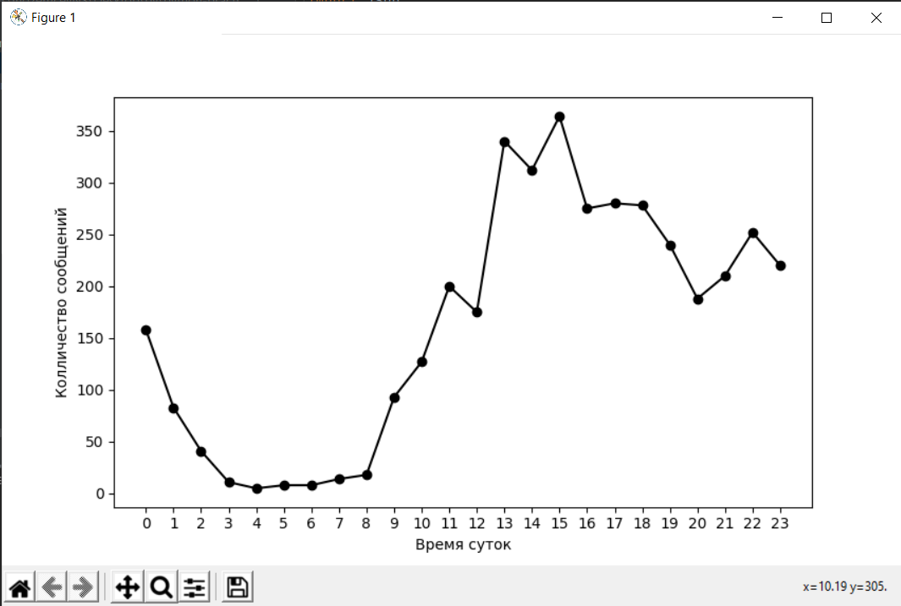
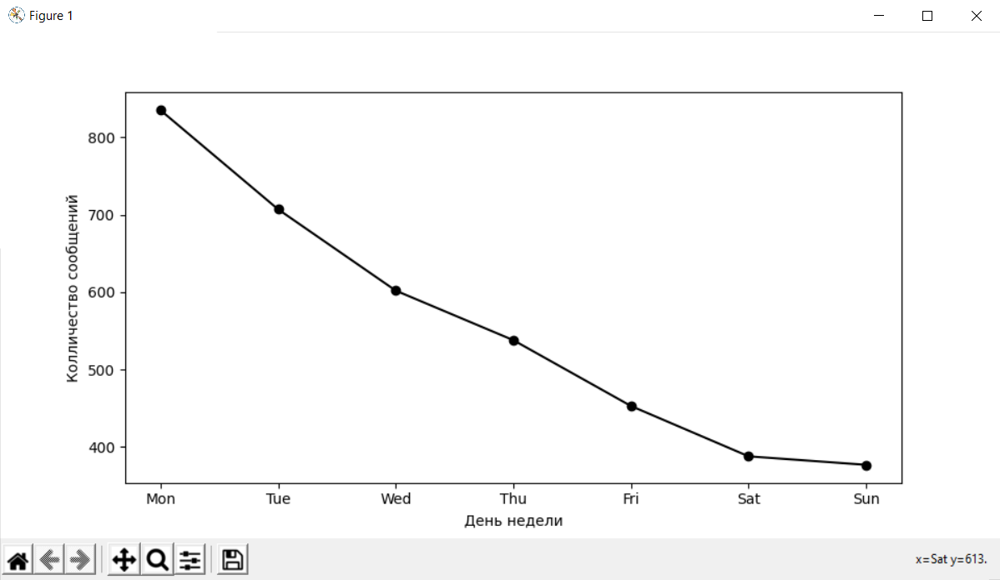
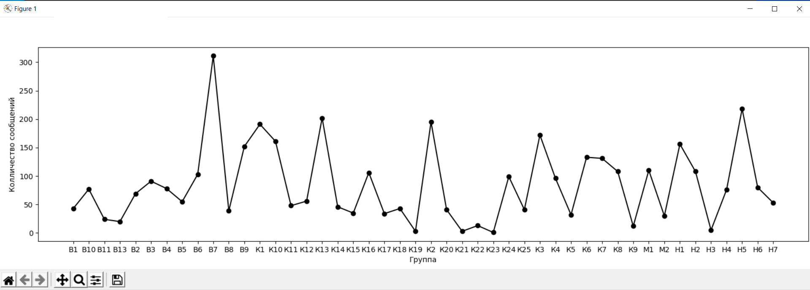
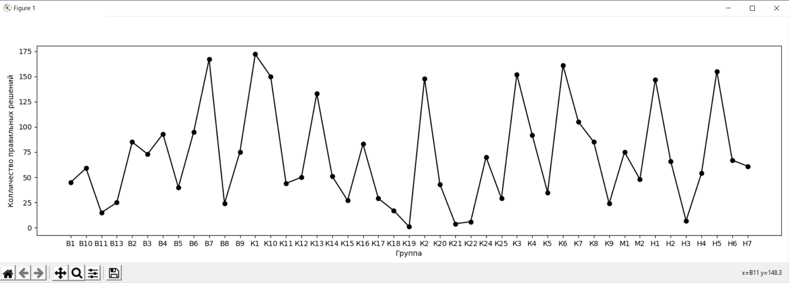
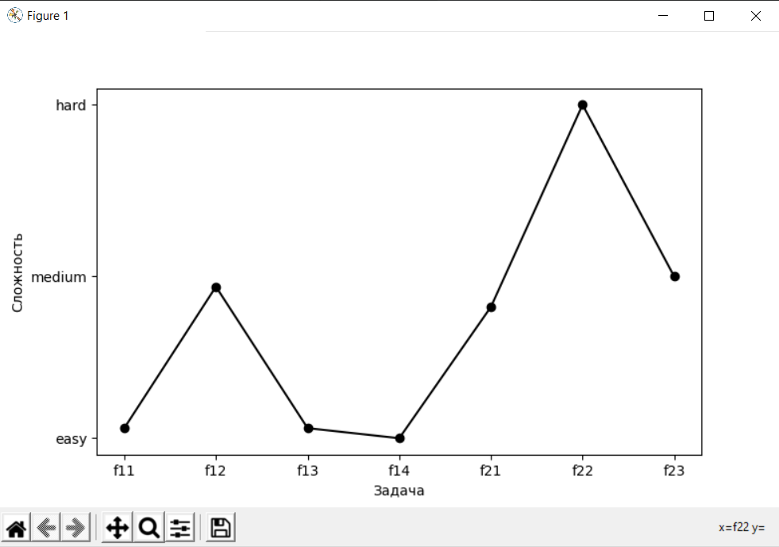

1. Как по времени суток распределяется активность студентов?
2. Как по дням недели распределяется активность студентов?
3. В каких группах было отправлено больше всего сообщений?
4. В каких группах было получено больше всего правильных решений?
5. Какие задачи оказались самыми легкими, самыми сложными?

1.
2.
3.
4.
5.