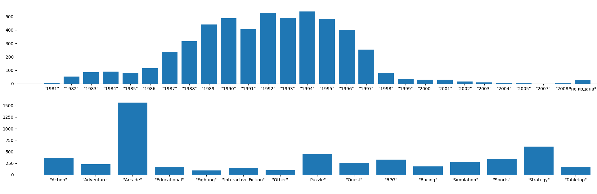

## Проанализировать базу данных старых компьютерных игр.

С помощью графиков ответить на следующие вопросы:
1. Какие годы были самыми популярными с точки зрения выхода игр?
2. Какие жанры были популярны в различные периоды времени?

____

Результат работы программы:

